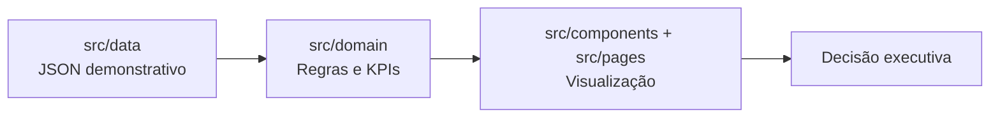
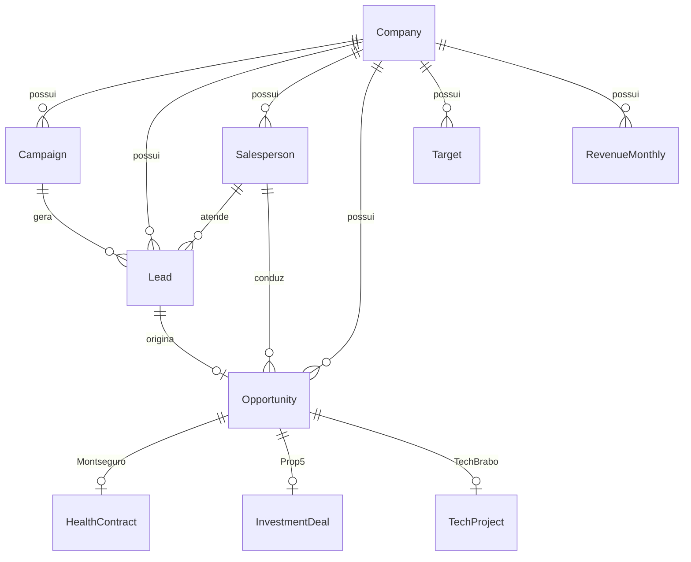

# Grupo Mont — Executive Dashboard

## Sobre o desafio

Esta solução foi construída para consolidar e analisar três empresas do Grupo Mont com modelos de negócio distintos:

- **Montseguro** — planos de saúde empresariais
- **Prop5** — consultoria e estruturação patrimonial/imobiliária
- **TechBrabo** — tecnologia B2B

O objetivo do dashboard é transformar dados simulados em indicadores executivos que apoiem decisões sobre meta, ritmo, funil comercial, marketing e riscos operacionais.

**Os dados utilizados nesta versão são demonstrativos/simulados.** Não representam informações reais do Grupo Mont.

---

## Como interpretei os três negócios

### Montseguro

Opera com planos de saúde empresariais. A jornada comercial modelada é:

Lead → Qualificação → Cotação → Proposta → Contratação → Implantação

Pontos centrais da interpretação:

- **Contrato ≠ vidas** — um contrato pode cobrir múltiplas vidas.
- **Contratação ≠ implantação** — assinar o contrato não significa que as vidas já foram implantadas.
- **Nesta modelagem demonstrativa, vidas implantadas são utilizadas como a métrica principal de resultado no período.**

### Prop5

Atua com consultoria e estruturação patrimonial/imobiliária. A jornada modelada é:

Lead → Qualificação → Diagnóstico → Reunião → Oportunidade → Negociação → Estruturação → Fechamento

Pontos centrais da interpretação:

- **Valor do ativo ≠ receita** — o volume financeiro do ativo não é o resultado da Prop5.
- **Pipeline ≠ venda** — oportunidades abertas representam potencial, não realizado.
- **Comissão ≠ volume financeiro** — nesta modelagem demonstrativa, a meta e o resultado são representados por comissão realizada.
- **Pipeline ponderado** = Σ(valor da oportunidade × probabilidade), representando potencial ajustado pela chance de conversão.

### TechBrabo

Empresa de tecnologia B2B. A jornada comercial modelada é:

Lead → Qualificação → Reunião → Diagnóstico → Proposta → Negociação → Contrato

Pontos centrais da interpretação:

- **Contrato assinado ≠ receita imediata** — a receita é reconhecida ao longo do tempo.
- **Receita pontual ≠ receita recorrente** — projetos e MRR têm dinâmicas diferentes.
- **MRR** representa a base recorrente ativa no período.
- Vendas devem ser analisadas junto com **capacidade e risco operacional** dos projetos ativos.

---

## Estratégia da solução

A construção seguiu a linha de raciocínio:

```
NEGÓCIO → PERGUNTA → DADOS → KPI → VISUALIZAÇÃO → DECISÃO
```

Primeiro foram entendidas as jornadas e diferenças entre os três modelos de negócio. Em seguida, os dados foram modelados em entidades compartilhadas e específicas. Depois, os KPIs foram definidos e implementados na camada de domínio. Por fim, a interface foi construída para consumir esses resultados — sem duplicar regras de negócio nos componentes.

---

## Arquitetura

O projeto segue uma separação clara de responsabilidades:

| Camada | Responsabilidade |
|--------|------------------|
| `src/data` | Dados demonstrativos em JSON e tipos TypeScript |
| `src/domain` | Regras de negócio, cálculos e KPIs |
| `src/components` | Componentes visuais reutilizáveis |
| `src/pages` | Composição das telas do dashboard |

Os componentes React **não calculam** os principais KPIs. Eles consomem resultados produzidos pela camada de domínio (`src/domain`).



---

## Modelagem de dados

### Entidades compartilhadas

| Entidade | Papel |
|----------|-------|
| `Company` | Identifica cada empresa do grupo |
| `Campaign` | Campanha de marketing com investimento e canal |
| `Lead` | Lead gerado por campanha |
| `Salesperson` | Vendedor responsável |
| `Opportunity` | Oportunidade comercial com estágio, valor e probabilidade |
| `Target` | Meta por empresa, período e métrica |

### Entidades específicas

| Empresa | Entidade | Papel |
|---------|----------|-------|
| Montseguro | `HealthContract` | Contrato de saúde com vidas, datas de contratação e implantação |
| Prop5 | `InvestmentDeal` | Deal de investimento com valor do ativo, comissão projetada e realizada |
| TechBrabo | `TechProject` | Projeto com receita pontual, MRR, risco e status operacional |

### Papel do `stageHistory`

Cada oportunidade possui um histórico de estágios (`stageHistory`) com data de entrada em cada etapa. Esse histórico permite:

- Calcular funis comerciais (quantas oportunidades alcançaram cada estágio)
- Medir conversões entre etapas
- Estimar ciclo médio (primeira → última etapa registrada)
- Identificar gargalos no funil

### Diagrama de relacionamentos



Uma camada comum permite consolidação do grupo, enquanto entidades específicas preservam as diferenças dos modelos de negócio.

---

## Áreas do dashboard

### CEO Overview (`/`)

Visão consolidada das três empresas com meta, realizado, atingimento, meta esperada até a data, gap de ritmo, forecast, comparação entre empresas e prioridades sugeridas ("Onde agir primeiro").

### Comercial (`/comercial`)

Funis específicos por empresa, conversões entre etapas, principal gargalo, ciclo médio, pipeline nominal/ponderado e performance por vendedor. Visão consolidada do grupo e abas por empresa.

### Marketing (`/marketing`)

Investimento, leads, oportunidades, CPL, custo por oportunidade, taxa Lead → Oportunidade, negócios finais e eficiência por canal. Abas por empresa.

### Empresas (`/empresas`)

Visão aprofundada de cada modelo de negócio com KPIs específicos e leitura de negócio contextual.

### Insights (`/insights`)

Alertas gerados por regras determinísticas com severidade (positivo, atenção, crítico), categoria, métrica relacionada e recomendação.

---

## Principais decisões técnicas

| Tecnologia | Uso |
|------------|-----|
| React + TypeScript | Interface tipada e componentizada |
| Vite | Build e desenvolvimento |
| React Router | Navegação entre áreas do dashboard |
| Tailwind CSS v4 | Estilização |
| Recharts | Gráficos (comparação executiva, funil, canais) |
| Lucide React | Ícones da navegação |
| JSON local | Fonte de dados demonstrativos |

**Por que não há backend:** o desafio permite dados simulados e o foco desta versão está em entendimento de negócio, modelagem de KPIs e visualização. Esta não é uma arquitetura de produção — é uma prova de conceito executiva com dados estáticos.

---

## Contexto temporal

| Conceito | Valor |
|----------|-------|
| Período de reporte | Agosto de 2026 (`2026-08`) |
| Data de referência (as-of) | 28/08/2026 |

### Diferença entre os conceitos de meta e ritmo

| Conceito | Significado |
|----------|-------------|
| **Meta final** | Valor-alvo do período completo (ex.: meta de vidas, meta de comissão ou meta de receita, conforme a empresa) |
| **Meta esperada até hoje** | Proporção linear da meta correspondente aos dias já decorridos no mês |
| **Realizado** | Valor efetivamente alcançado até a data de referência |
| **Gap de ritmo** | Realizado − meta esperada até hoje (negativo = abaixo do ritmo) |
| **Forecast** | Projeção de fechamento do período com base no ritmo ou pipeline (varia por empresa) |
| **Forecast vs meta** | Percentual do forecast em relação à meta final — base do status executivo |

---

## Premissas e limitações

- Dataset **completamente demonstrativo** — valores não representam dados reais do Grupo Mont.
- **Sem backend** — todos os dados são carregados de arquivos JSON locais.
- **Sem autenticação** — não há controle de acesso ou perfis de usuário.
- **Sem integração** com CRM, ERP ou sistemas financeiros.
- **Forecast Montseguro e TechBrabo** usa ritmo linear: `realizado × (dias do mês / dias decorridos)`.
- **Forecast Prop5** combina comissão realizada no período com comissão projetada das oportunidades abertas cujo `expectedCloseDate` cai no período, ponderada por probabilidade.
- **Receita pontual da TechBrabo** no dataset é a soma de `pointRevenue` dos projetos ativos — não há reconhecimento mensal detalhado por projeto.
- **Funil comercial** considera todas as oportunidades da empresa (não filtradas por período de criação).
- **Marketing** considera campanhas do período de reporte e todos os leads vinculados a cada campanha.
- Não existe histórico temporal suficiente para métricas como LTV real ou cohorts.
- Thresholds executivos (verde/amarelo/vermelho) são regras demonstrativas configuráveis em `src/domain/common.ts`.
- Período de reporte e data de referência são fixos em `src/domain/period.ts` — não há filtro dinâmico na interface.

---

## Melhorias futuras

- Integração com fontes reais de dados (CRM, ERP, financeiro)
- Filtros por período e comparação entre meses
- Histórico temporal maior para tendências e sazonalidade
- Drill-down de KPIs até o registro individual
- Autenticação e perfis de acesso (CEO, comercial, marketing)
- Alertas configuráveis pelo usuário
- Implementação de testes automatizados (unitários e de integração)
- Refinamento da experiência mobile
- Maior governança de dados (validação, versionamento, auditoria)

---

## Como executar

Instalar dependências:

```bash
npm install
```

Iniciar o servidor de desenvolvimento:

```bash
npm run dev
```

Build de produção:

```bash
npm run build
```

Visualizar o build localmente (após o build):

```bash
npm run preview
```

---

## Estrutura do projeto

```
grupo-mont-dashboard-gabz/
├── src/
│   ├── data/              # JSONs demonstrativos e tipos
│   │   ├── campaigns.json
│   │   ├── companies.json
│   │   ├── healthContracts.json
│   │   ├── investmentDeals.json
│   │   ├── leads.json
│   │   ├── opportunities.json
│   │   ├── revenueMonthly.json
│   │   ├── salespeople.json
│   │   ├── targets.json
│   │   ├── techProjects.json
│   │   └── types.ts
│   ├── domain/            # Regras de negócio e KPIs
│   │   ├── common.ts
│   │   ├── period.ts
│   │   ├── overview.ts
│   │   ├── montseguro.ts
│   │   ├── prop5.ts
│   │   ├── techbrabo.ts
│   │   ├── commercial.ts
│   │   ├── marketing.ts
│   │   ├── companies.ts
│   │   └── insights.ts
│   ├── components/
│   │   ├── layout/        # AppShell, Sidebar, Header
│   │   ├── dashboard/     # Cards e gráficos do CEO Overview
│   │   ├── commercial/    # Funil, gargalo, vendedores
│   │   ├── marketing/     # Campanhas e canais
│   │   ├── companies/     # Painéis por empresa
│   │   ├── insights/      # Lista de insights
│   │   └── shared/        # Componentes compartilhados
│   ├── pages/             # Uma página por rota
│   ├── utils/             # Formatação de valores
│   ├── App.tsx
│   ├── main.tsx
│   └── index.css
├── README.md
├── KPIS.md
├── package.json
└── vite.config.ts
```

Para o catálogo completo de indicadores, consulte [KPIS.md](./KPIS.md).
